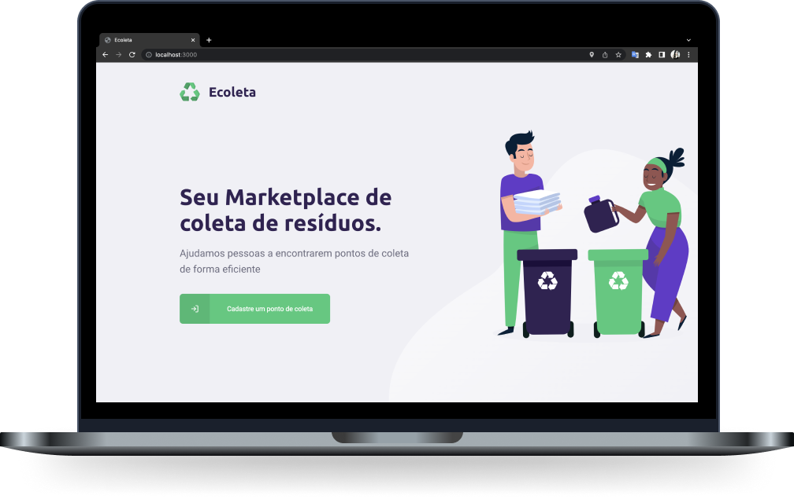
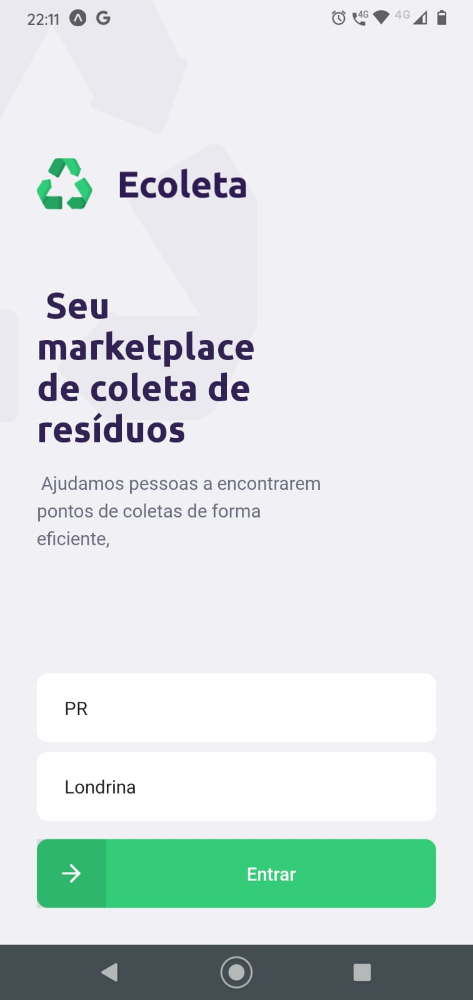
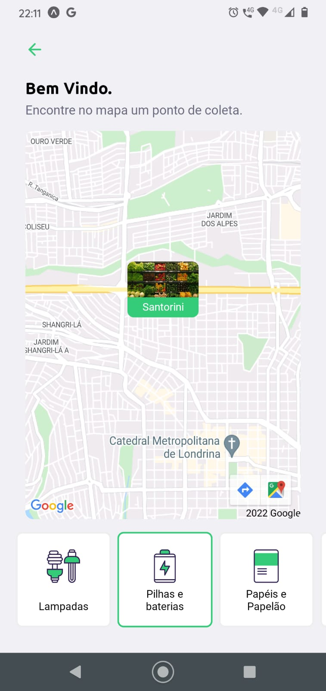
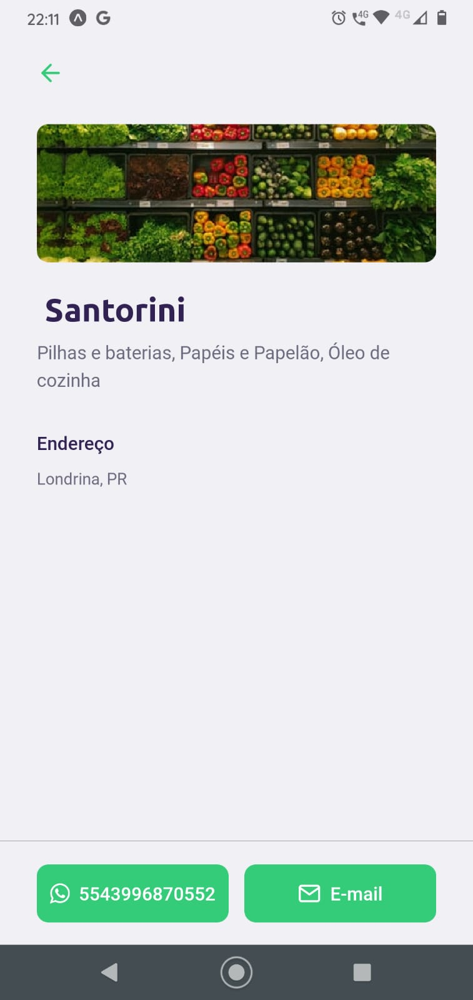

<h1 align="center">
  
  <br/>
  
</h1>

<p align="center">
  <a href="#-tecnologias">Tecnologias</a>&nbsp;&nbsp;&nbsp;|&nbsp;&nbsp;&nbsp;
  <a href="#-projeto">Projeto</a>&nbsp;&nbsp;&nbsp;|&nbsp;&nbsp;&nbsp;
  <a href="#-frontend">Frontend</a>&nbsp;&nbsp;&nbsp;|&nbsp;&nbsp;&nbsp;
  <a href="#-mobile">Mobile</a>&nbsp;&nbsp;&nbsp;|&nbsp;&nbsp;&nbsp;
  <a href="#-instalação">Instalação</a>&nbsp;&nbsp;&nbsp;|&nbsp;&nbsp;&nbsp;
  <a href="#-licença">Licença</a>
</p>

<br>

---
## 🚀 Tecnologias

Esse projeto foi desenvolvido com as seguintes tecnologias:

- [Node.js](https://nodejs.org/en/)
- [React](https://reactjs.org)
- [React Native](https://facebook.github.io/react-native/)
- [Expo](https://expo.io/)
- [API do IBGE para consumo do endereço](https://servicodados.ibge.gov.br/api/docs/localidades?versao=1#api-UFs-estadosGet)
- [Upload de imagens](react-dropzone)
- [Leaflet](https://leafletjs.com/examples/quick-start/)
- [Celebrate](https://github.com/arb/celebrate) 

## 💻 Projeto
Projeto desenvolvido durante a <strong>Next Level Week</strong> que tem como objetivo fins ecológicos. 
O <strong>Ecoleta</strong> serve como um Marketplace, uma conexão entre empresas ou entidade que coletam resíduos, sejam eles orgânicos ou inorgânicos, à pessoas que precisam fazer descarte dos resíduos.


## 🌐 Frontend
<h1 align="center">
    
</h1>

## 📱 Mobile
<h1 align="center">
    
    
    

</h1>

## 🔥 Instalação

```bash
# Clone este repositório
$ git clone git@github.com:FernandaDsilva/Ecoleta-Boster.git

# Navegue em cada pasta: server / web / mobile e instale as depedências:
$ npm install

# Navegue até a pasta server e execute os seguintes comandos:
$ npm run knex:migrate
$ npm run knex:seed
$ npm run dev

# Depois disso, entre na pasta web e execute o comando:
$ npm start

# E finalmente, entre na pasta mobile e execunte o comando:
$ expo start

# Observações:
- Não esqueça de mudar a baseURL no arquivo api.ts das pastas web e mobile para o ip da sua máquina
```

## 🧾 Licença

Esse projeto está sob a licença MIT. Veja o arquivo [LICENSE](LICENSE.md) para mais detalhes.

---

Feito com 💗 by [Fernanda Dias](https://www.linkedin.com/in/fernanda-dias-silva/)